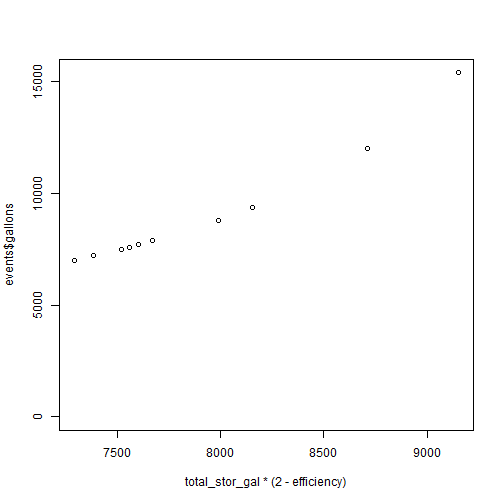
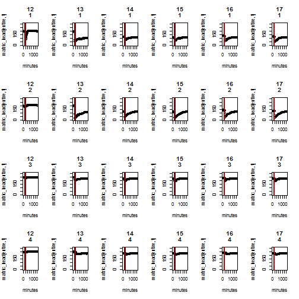

```r
## Read in matric potential, temperature and event data
foo=read.csv("C:/Campbellsci/PC200W/CR1000-AB2_Table1.csv")
  # Tensiometer and temperature time series
events=read.csv("ct_alfalfa_events.csv") 
  # Flood event times and control volumes
tensio=read.csv("tensio_events.csv")
  # Mapping of tensiometer ID to plot #, treatment and "active" events
tensio_calib=read.csv("tensiometer_calibration.csv")

## ===SETUP===
PT_id = 2:21                      
  # Range for columns containing pressure transducer data (20 transducers)
T_id = 43:51                      
  # Range for columns containing temperature data (9 thermistors)
major_x = "1 week"                
  # Increment between labeled gridlines
minor_x = "1 day"                 
  # Increment between minor gridlines
origin_time="01/26/2015 10:00"    
  # Origin for time axis

## Formatting
TIMESTAMP = as.POSIXct(strptime(foo[,1],"%m/%d/%Y %H:%M"))   # Make POSIX datetime from time column
event_start = as.POSIXct(strptime(events[,4],"%m/%d/%Y %H:%M"))   # Make POSIX datetime for flood event start and end times
event_end = as.POSIXct(strptime(events[,5],"%m/%d/%Y %H:%M"))
time_test=ts(TIMESTAMP,frequency=length(TIMESTAMP))               # Create a timeseries object for data timestamp
origin=as.POSIXct(strptime(origin_time,"%m/%d/%Y %H:%M"))        # Convert origin into POSIX datetime
index=seq(1,length(TIMESTAMP))
tindex=index*15      # Each record is 15 minutes, multiply index by 15 to yield time in minutes for each record
hour=as.numeric(substr(TIMESTAMP,12,13))      # Parse out hour of day

time_map=cbind(index,tindex,TIMESTAMP) #TODO add day, hour, event timestamps?

# Data transformations
keep=((as.numeric(TIMESTAMP)-as.numeric(origin) > 0))      
TIMESTAMPa=TIMESTAMP[keep]
TIMESTAMPn=seq(0,length(TIMESTAMPa))*15

foo2=foo #COPY loaded data
foo2[,PT_id+1]=(foo[,PT_id+1]-370)/1.742 #convert mV to mbar (cm H2O)
data=foo2[keep,] # Trim the data to start at the time axis origin (defined above)

matric_head=data[,PT_id+1] #make some more convenient frames and column names
names(matric_head)=seq(1,20)
matric_std=data[,PT_id+21]

temp_sensor=data[,T_id+30] #make some more convenient frames and column names
```

```
## Error: undefined columns selected
```

```r
names(temp_sensor)=seq(1,20)
```

```
## Error: object 'temp_sensor' not found
```

```r
temp_std=data[,T_id+21]
```

```
## Error: undefined columns selected
```

```r
subsetTimes=function(time_start,time_end,buf=3600) { #Returns data records corresponding to specified time interval
 start=makePOSIXTime(time_start)-2*buf #get data for 2 hours prior to start of event
 end=start+86400
 tend=makePOSIXTime(time_end)
 if(end>tend) end=tend
 gte=(TIMESTAMPa>=start)
 lt=(TIMESTAMPa<end)
 who=which((gte+lt)==2)
 return(who)
}

makePOSIXTime=function(tee) {
  return(as.POSIXct(strptime(tee,"%m/%d/%Y %H:%M")))
}

#Calculate surface boundary conditions

#Assumed geometric "constants" for all 5 plots - can be treated on an individual basis also
ch_depth=30#mean(c(20,21,25,21,25,23,22,22,20,25,22,22,22,22,19,22,23,21,24,22,22,21,20,21,22,20,22)) #22 cm vertical
ch_width=75#mean(c(2.5,2.5,2.6,2.6,2.5,2.5))*30.48
plot_width=600#mean(c(20,18,19,20,22))*30.48
plot_length=1500#50*30.48
gal_per_cc=0.000264172
ch_stor_gal=((2*ch_width)*plot_length*(ch_depth/2))*gal_per_cc #gallons of storage in both side channels per plot
tensio_clust_l=plot_length/2*30.48 #tensiometers at 1/2 length of plot
tensio_clust_w=plot_width/2*30.48
plot_stor_gal=((plot_length*plot_width)+(plot_length*ch_width*2))*(ch_depth/2)*gal_per_cc
total_stor_gal=ch_stor_gal+plot_stor_gal

ch_fill_time=0
plot_fill_time=0
efficiency=0
for(e in 1:length(events$Date)) {
  flowrate=events$Flow.rate[e]
  ch_fill_time[e]=ch_stor_gal/flowrate
  plot_fill_time[e]=plot_stor_gal/flowrate
  efficiency[e]=plot_fill_time[e]/events$minutes[e]
}
plot(total_stor_gal*(2-efficiency),events$gallons)
```

 

```r
t_arrival=ch_fill_time+(plot_fill_time/2)
events2=cbind(events,t_arrival)
#events2

for(p in 1:5) { #loop through 5 monitored plots
  plot=tensio[p,]
  tid=c(plot$s1,plot$s2,plot$d1,plot$d2)
  eid=seq(plot$eventstart,plot$eventend)
  par(mfcol=c(length(tid),length(eid)))
  for(e in eid) {
    start_time=events[e,]$START #get event start time (water on)
    off_time=events[e,]$END     #get water off time
    end_time=events[e+1,]$START #get start of next event (AKA end of current)
    entire=subsetTimes(start_time,end_time)
    minutes=seq(0,length(entire)-1)*15
    irrig=subsetTimes(start_time,off_time,buf=0)
    irr_start=which(entire==irrig[1])
    irr_stop=which(entire==irrig[length(irrig)])
    for(t in tid) {
      plot(minutes,matric_head[entire,t],main=paste(c(e,t),sep=":"),ylim=c(0,300))
      abline(v=c(minutes[irr_start],minutes[irr_stop]))
      abline(v=minutes[irr_start]+events2$t_arrival[e],col="red")
      #plot(TIMESTAMPa[entire],matric_std[entire,t],main=paste(c(e,t),sep=":"),ylim=c(0,100))
    }
  }
}
```

    

```
## Error: figure margins too large
```
\end
